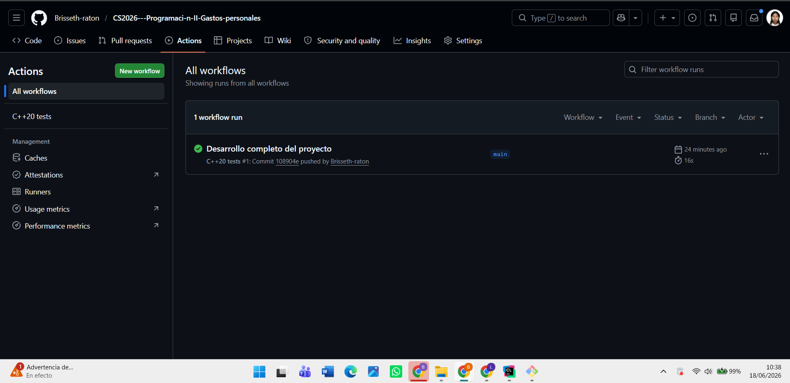

# Gastos personales – Patrones de diseño en C++20

## Decisiones de diseño

### Organización del proyecto

El proyecto se organizó separando responsabilidades en carpetas pequeñas y específicas para favorecer bajo acoplamiento, facilitar mantenimiento y permitir extensión futura sin modificar componentes existentes.

```text
include/
├── concepts/
├── strategy/
├── factory/
├── exporters/
└── decorators/
```

---

## concepts/

Se creó una carpeta exclusiva para **concepts** porque en C++20 los conceptos representan **contratos del sistema** y restricciones del dominio, no implementaciones concretas.

Archivos:

* `ExpenseExporter`
* `SortStrategy`

Separarlos permite reutilizar estos contratos desde cualquier módulo sin generar dependencias innecesarias.

Beneficios:

* Mayor legibilidad.
* Restricciones expresadas explícitamente.
* Menor acoplamiento.
* Mayor extensibilidad.

---

## strategy/

Se aisló el mecanismo de ordenamiento usando el patrón **Strategy** porque el criterio de orden puede cambiar sin modificar el flujo principal del sistema.

Este patrón desacopla:

```text
Ordenamiento
      |
      |
Datos de gastos
```

El sistema acepta cualquier callable compatible con `sort_with()`.

Ejemplos:

* Orden por fecha.
* Orden por categoría.
* Orden por monto.

Agregar nuevas estrategias no requiere modificar código existente.

---

## factory/

Se separó la creación de exportadores utilizando **Factory Method**.

La fábrica desacopla:

```text
Creación del exportador
        |
        |
Uso del exportador
```

El cliente nunca necesita lógica repetitiva como:

```cpp
if (format == "csv")
```

o

```cpp
switch (...)
```

Para agregar un nuevo exportador únicamente se implementa una nueva clase y se reutiliza:

```cpp
make_exporter<NuevoExporter>()
```

---

## exporters/

Se creó una carpeta exclusiva para exportadores base porque representan el comportamiento principal del sistema: transformar una lista de gastos a un formato de salida.

Exportadores implementados:

* `CsvExporter`
* `JsonExporter`
* `TextExporter`

Cada exportador tiene una única responsabilidad:

```text
ExpenseList
     |
     |
std::string
```

Esto sigue el principio de responsabilidad única.

---

## decorators/

Aunque técnicamente también exportan, se separaron de `exporters/` porque cumplen un propósito distinto.

Los decoradores no generan formatos nuevos; agregan comportamiento adicional sobre exportadores existentes.

Ejemplo:

```cpp
AuditedExporter{
    SummaryExporter{
        CsvExporter{}
    }
}
```

El patrón **Decorator** desacopla:

```text
Formato de salida
         |
         |
Procesamiento adicional
```

Esto permite agregar funcionalidades como:

* Auditoría.
* Resumen.
* Nuevas etapas futuras.

Sin modificar exportadores ya implementados.

---

## Uso idiomático de C++20

El proyecto prioriza características modernas del lenguaje, cumpliendo con la tabla de evaluacion:

* **Concepts** para expresar contratos.
* **Templates** para desacoplar implementaciones.
* **std::ranges::sort** para estrategias.
* **RAII** mediante objetos automáticos.
* Evitar `new/delete`.

Se favoreció composición sobre herencia.

---

## ¿Qué patrón desacopla qué parte?

Estos son los tres patrones de diseño para desacoplar responsabilidades y facilitar extensión futura.

Factory Method: desacopla la creación de exportadores del código cliente. El sistema puede generar exportadores CSV, JSON o texto mediante make_exporter<E>() sin usar condicionales ni modificar el flujo principal. 

Decorator: desacopla el procesamiento adicional de la salida del mecanismo base de exportación. Funcionalidades como auditoría o resumen se agregan envolviendo exportadores existentes sin cambiar su implementación. 

Strategy: desacopla el criterio de ordenamiento de la estructura de datos. El sistema puede ordenar gastos por fecha, categoría o monto usando comparadores intercambiables compatibles con sort_with(). 

En conjunto, estos patrones permiten agregar nuevos formatos de exportación, nuevos criterios de ordenamiento y nuevas etapas de procesamiento sin modificar el flujo principal del programa.

---

## Evidencias

Repositorio: https://github.com/Brisseth-raton/CS2026---Programaci-n-II-Gastos-personales 


